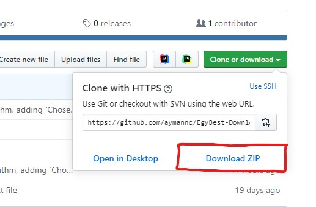
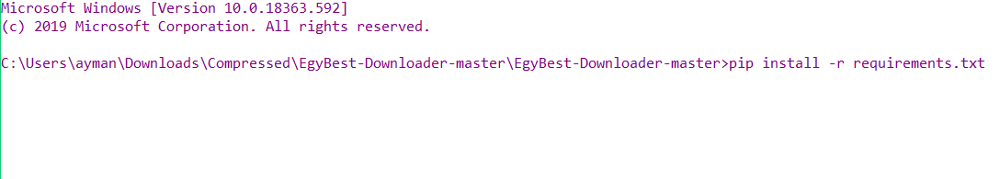

# EgyBest Downloader (v 1.1.0)


Try to download `Supernatural` with its 316 episodes from EgyBest or any website, that's a lot of clicks and ads :( .

**EgyBest Downloader** gives you the possibility to download any movie or a Tv series from 
EgyBest without the annoying ads .
* ***Currently working on a Gui version*** 
## What's new 
* (v 1.0.2) : updating the search and ad closing algorithm, adding `Chose quality` option . 

* (v 1.1.0 ) : Fixing major bugs and improving code quality.
## Important !!
* The goal from this programme is to gather download links for you .
* You'll find the downloads link on a local file with the following format `type-name-year.txt`  in the "LinkSaves" folder.

* You can add the links automatically to Internet download manager (IDM) and download them ,but if you don't like using 
IDM or don't have it installed or activated(see Prerequisites for a solution),
you can use the built in command line downloader, or you can copy all the links and use `add batch download from clipboard` 
on your favorite download manager .

.
## Prerequisites

* For the IDM functionalities you'll need IDM [Internet download manager](https://www.internetdownloadmanager.com/download.html)
 installed on the default directory .
```
C:\Program Files (x86)\Internet Download Manager
 ```
 or you can change the path inside the code .

* You'll need python installed on a windows machine .
* The Latest version of google chrome (currently supporting chrome only).

## Installing (Beginners friendly !)

* First of all, activate your expired versions of IDM using [idm-trial-reset](https://github.com/J2TeaM/idm-trial-reset/releases/tag/v1.0.0) tool to reset the 30 days free trial ,then start the installation process.

1. Install Python ,this video will show you how :
[](https://www.youtube-nocookie.com/embed/4Rx_JRkwAjY?start=0&end=249 "How to install python")

1. The next step is to download or clone th project from github :
    * Download the source code as a zip folder :
        
    *  Or clone the directory on your local machine (if you have git installed )
        ```
        git clone https://github.com/aymannc/EgyBest-Downloader
         ```
1. Now is the time to install the requirements for the project :
    1. Open the commande line in the downloaded folder ,this is a video:
        [](https://www.youtube-nocookie.com/embed/bgSSJQolR0E "How to open cmd")
    1. Past the following command in cmd :
        ```
        pip install -r requirements.txt
        ```
       
       
If everything went right ,now you have a working version of the project.
## Running the programme
* Open the cmd on the containing folder and past the following line (see above if you don't know how to open cmd !):
    ```
    python main.py
    ```
## Built With

* [Beautifulsoup4](https://www.crummy.com/software/BeautifulSoup/) - Python library designed for quick turnaround projects like screen-scraping
* [Selenium](https://selenium.dev/) - It's library used for browser automation
* [pySmartDL](https://github.com/iTaybb/pySmartDL) - It's a python download manager

## Authors

* **Nait Cherif Ayman**- [aymannc](https://github.com/aymannc)

## License

This project is licensed under the MIT License 

## Acknowledgments

* Thank you EgyBest for the hard work you provide

## Q & A

soon
